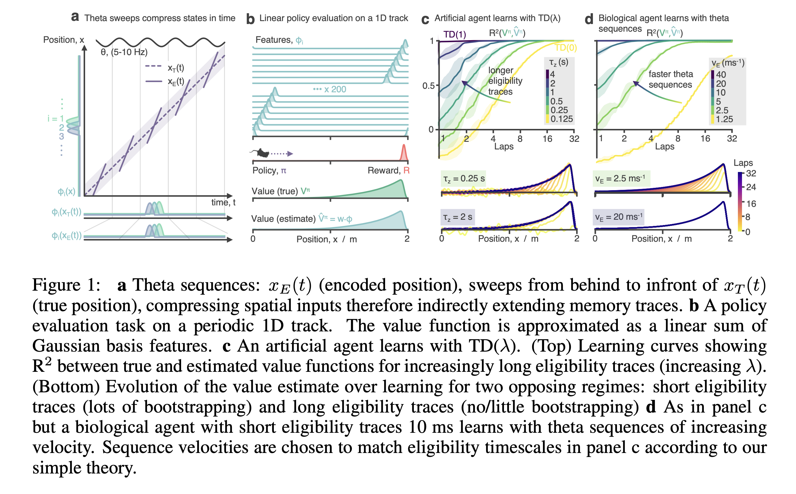

# Eligibility sweeps

This repo contains code for replicating the results in the ICLR 2023 Tiny Paper (Tiny Paper tracks): "Theta sequences as eligibiility traces: A biological solution to credit assignment"  

In this paper I how how theta sequences (fast hippocampal play throughs of awake behaviour) enable agents to learn under a regime effectively equivalent to TD($\lambda$) (i.e.. learning with bioimplausibly long memory traces). Here's the abstract: 

## Abstract 
Credit assignment problems, for example policy evaluation in RL, often require bootstrapping prediction errors through preceding states \textit{or} maintaining temporally extended memory traces; solutions which are unfavourable or implausible for biological networks of neurons. We propose theta sequences -- chains of neural activity during theta oscillations in the hippocampus, thought to represent rapid playthroughs of awake behaviour -- as a solution. By analysing and simulating a model for theta sequences we show they compress behaviour such that existing but short $\mathsf{O}(10)$ ms neuronal memory traces are effectively extended allowing for bootstrap-free credit assignment without long memory traces, equivalent to the use of eligibility traces in TD($\lambda$).

## Main paper figure

## To run the code: 
This jupyter note repicates the code. You can open it with google collab here. 